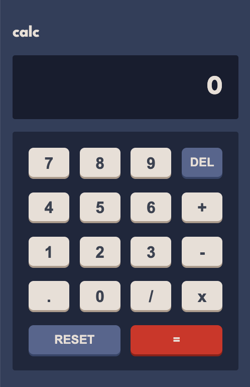
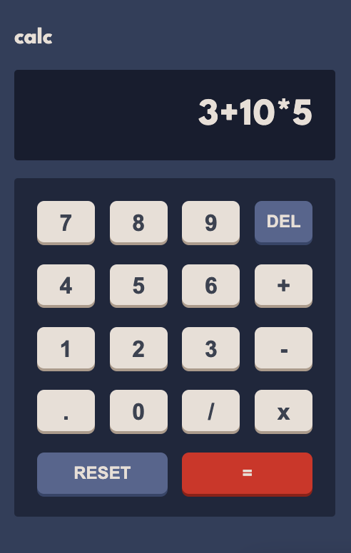

[](https://classroom.github.com/open-in-codespaces?assignment_repo_id=10798847)
# Lab 2

Samantha Murray Tuesta

## Code base

Instead of starting from scratch, you will start with a code base for this lab. The code base was revised from some code generated by ChatGPT. You can change anything in the code base to achieve the desired functionality and design. However, it is your responsiblity to maintain the test cases and make sure that the tests can run.

Currently, there are 8 test cases prepared under the `__test__` folder. Two `testID`s are heavily used to construct the test cases. You can find where the two `testID`s are placed in the `CalculatorScreen.js` file under the `screens` folder.

## Functionality

You may play with the basic calculator on your cellphone. Your app should function the same as the basic calculator on your cellphone in terms of functionality. You are the one to find out what rules the basic calculator abides. 

You may use `eval()` method in JavaScript as an easy approach to do the calculation, and achieve the functionality. For example, given a valid calculation formula as a string, the `eval()` method can do the calculation for you:

```
// should return 53
eval('3 + 5 * 10')
```

If you decide to go with this approach, you may also want to search online and read about why you should be careful with the `eval()` method.

You will need to address all possible edge cases and potential errors, such as:

* a number divided by 0
* a user attempting to type numbers with leading zeros (e.g., 3+005) 
* a user attempting to type neighboring operators (e.g., +/)

You will need to add a test case per scenario. Please note that this is not an exhaustive list.

## Design

See [the expected design](./design/mobile-design.jpg) in the design folder. Your calculator app should look as the following.



Please read more in [the style guide](./style-guide.md) about the specs of our design expectation. Please try your best to make your app look the same as the expected design. 

An example of calculation with this design is as following:



# Simulated App
Simulated Calculator Code application on a iPhone 14 Pro Max


## To do

When you finish, please do the following:

1. design and develop the application
1. add your tests to cover all possible user error scenarios
1. commit and push your code
2. add your name to this README file (see above)
3. capture how your app looks locally in the simulated app on your machine
4. put the captured image in the design folder
5. edit this README file to display your captured image here in this README file (see the above displayed expected design as an example)