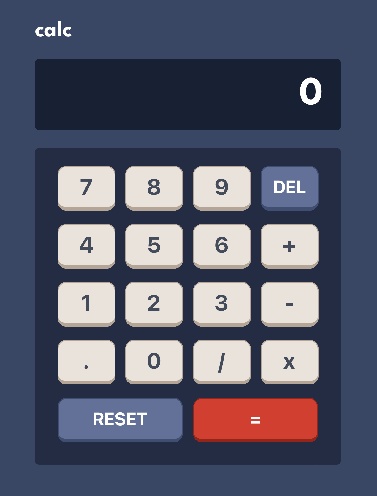

# Calculator App
A simple Calculator application simulated on an iPhone 14 Pro Max developed as part of a Mobile Application Development Course through Western Washington University.

[](https://reactnative.dev/) [](https://expo.dev/) [](https://img.shields.io/badge/os-macOS-green.svg) [](https://github.com/sammurraytuesta)

<!-- TABLE OF CONTENTS -->
<details>
  <summary>Table of Contents</summary>
  <ol>
    <li><a href="#Code-Base">Code Base</a></li>
    <li><a href="#Application">Application</a></li>
    <ul>
        <li><a href="#Functionality">Functionality</a></li>
        <li><a href="#Design">Design</a></li>
    </ul>
    <li><a href="#Thank-You">Thank You!</a></li>
  </ol>
</details>

## Code Base
Instead of starting from scratch, a code base has been generated for this application. The code base was revised by Professor Qiang Hao at Western Washington University from some code generated by ChatGPT.

## Application
Developed a simple Calculator application using React Native and Expo. Below is the simulated Calculator application on an iPhone 14 Pro Max:



### Functionality

The application is the same as the basic calculator on your cellphone in terms of functionality.

The `eval()` method in JavaScript is used for calculation, and to achieve main functionality. For example, given a valid calculation formula as a string, the `eval()` method can do the calculation for you:

```
// should return 53
eval('3 + 5 * 10')
```

Edge cases and potential errors that are handled in this application are as follows:

* a number divided by 0
* a user attempting to type numbers with leading zeros (e.g., 3+005) 
* a user attempting to type neighboring operators (e.g., +/)

A test case has been developed per each scenario.

### Design
For information on the design specs of the application, see [the style guide](./style-guide.md).

## Thank You!
Enjoy this simple Calculator application!

